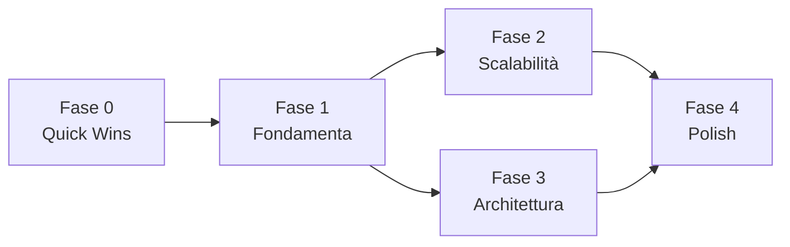
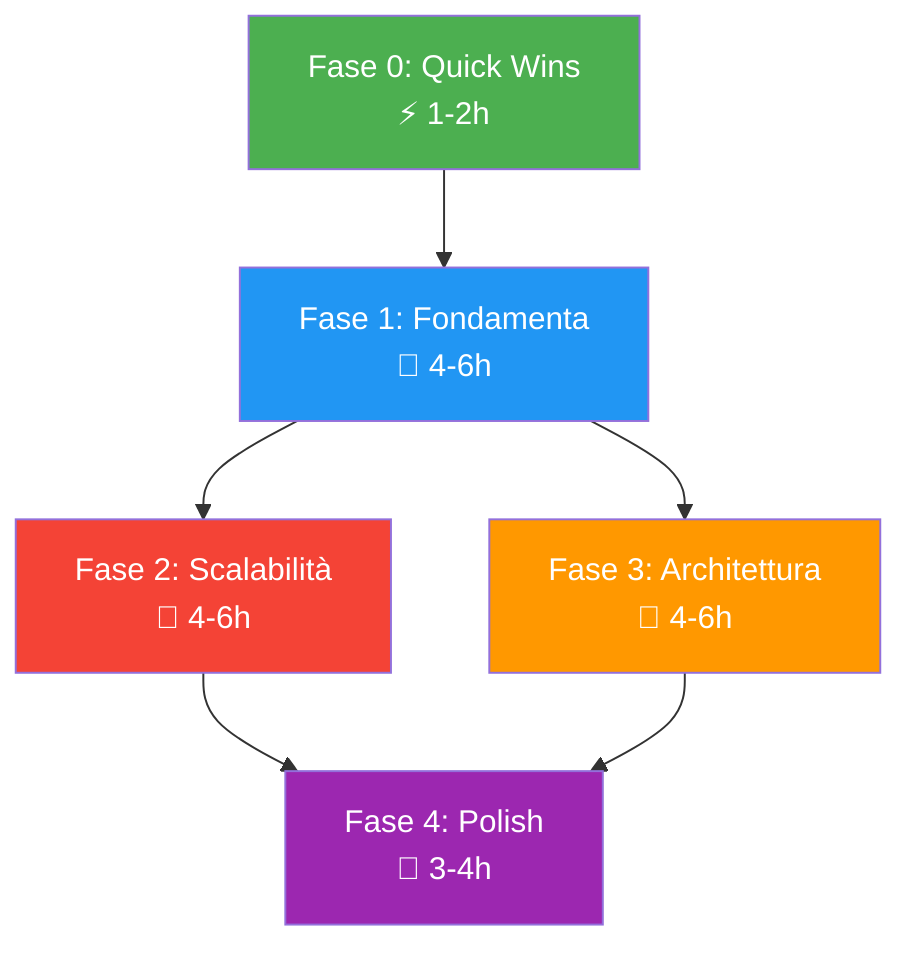

# 🏗️ Blueprint di Refactoring Unificato
## Nei Map — Piano d'Azione Completo

**Audit completato:** 2026-06-28  
**File analizzati:** ~50 (esclusi autogenerati e binari)  
**Criticità totali trovate:** ~71  
**Target:** 1000+ nei, SDK 35/36, 60fps sotto stress

---

## Executive Summary

L'architettura del progetto è **sorprendentemente solida** per un'app vibe-coded: MVI/MVVM con Repository pattern, Hilt DI, Room, Compose con `@Immutable` UiState, e spatial hashing per la ricerca O(1) dei marker. Tuttavia, l'analisi ha scoperto **5 criticità bloccanti** per la scalabilità a 1000+ nei e **66 criticità di design/pulizia** distribuite su tutti i layer.

### Le 5 Criticità Bloccanti

| # | Criticità | Blocco | Impatto |
|---|---|---|---|
| 1 | `cachedTimelineFlow` pre-alloca **~60MB RAM** con 1000 nei × 300 date | B4-RF1 | **OOM / ANR** |
| 2 | Room Entity leak in **20+ punti** del layer UI (7 file) | B4-RF3, B6-RF1 | **Accoppiamento** → cascading changes |
| 3 | `SettingsScreen.kt` **1011 righe**, 10 composable, 14 callback | B5-RF1 | **Manutenibilità zero** |
| 4 | Thread safety: stato Compose scritto da **thread CameraX** | B5-RF2 | **Crash in produzione** |
| 5 | `delay(1000)` fake per import/export — completamento **mai tracciato** | B4-RF2 | **Data loss silente** |

---

## Piano d'Azione in 5 Fasi

Le fasi sono ordinate per **rischio** (prima i fix a rischio zero) e **dipendenza** (le fondamenta prima della ristrutturazione).

---

## Fase 0 — Quick Wins (Rischio Zero)
> Modifiche meccaniche che non cambiano logica. Eseguibili in qualsiasi ordine.

| # | Azione | File | Blocco | Effort |
|---|---|---|---|---|
| 0.1 | Aggiungere `@Immutable` a `MoleUiModel` | `MoleUiModel.kt` | B4-RF6 | ⚡ |
| 0.2 | Rimuovere import morti (`BodySide`, `Context`, `getLocalizedColorLabel`) | `BodyMapViewModel.kt`, `BodyMapScreen.kt`, `MoleMarker.kt` | B4-RF10, B5-RF9, B6-RF9 | ⚡ |
| 0.3 | Rimuovere `MoleAnalysisResult` data class inutilizzata | `AutoCameraScreen.kt:51-55` | B5-RF8 | ⚡ |
| 0.4 | Fix nome file foto: `"mole_.jpg"` → `"mole_${nanoTime}.jpg"` | `AutoCameraScreen.kt:142` | B5-RF5 | ⚡ |
| 0.5 | Spostare `calculateLaplacianVariance` in `utils/` | `AutoCameraScreen.kt:379-407` | B5-RF13 | ⚡ |
| 0.6 | Unificare `parseHexColor` — sostituire `Color.parseColor()` inline | `MoleDetailsScreen.kt:455`, `MoleDetailsComponents.kt:117,186`, `MoleLegend.kt:81` | B5-RF4, B6-RF2 | ⚡ |
| 0.7 | Estrarre `formatRelativeDate()` da logica duplicata | `MoleDetailsComponents.kt:206-213`, `SplitViewScreen.kt:181-187` | B6-RF7 | ⚡ |
| 0.8 | Aggiungere flag `isProfileImage` a `ImageEditorRoute` | `Routes.kt`, `SkinHistoryNavGraph.kt:254` | B6-RF8 | ⚡ |

**Effort stimato: ~1-2 ore**

---

## Fase 1 — Fondamenta (Layer Boundary + DRY)
> Crea i modelli UI, elimina il leak di entity, unifica le utility. **Prerequisito per le fasi 2 e 3.**

| # | Azione | File Coinvolti | Blocco | Effort |
|---|---|---|---|---|
| 1.1 | Creare `BackgroundVariantUiModel` esteso + `BackgroundCategoryUiModel` | Nuovo `ui/models/`, `BodyMapUiState.kt` | B4-RF3, B6-RF1 | 🔨 |
| 1.2 | Mappare entity→UiModel in tutti i ViewModel | `BackgroundSettingsVM`, `VariantManagementVM`, `MoleDetailsVM`, `BodyMapVM` | B4-RF3, B6-RF1 | 🔨🔨 |
| 1.3 | Sostituire `BackgroundVariantEntity` nei componenti UI (14 occorrenze) | `BackgroundSettings.kt`, `MoleDetailsComponents.kt`, `VariantManagementBottomSheet.kt` | B6-RF1 | 🔨🔨 |
| 1.4 | Creare `ThumbnailGenerator` condiviso | Nuovo `data/ThumbnailGenerator.kt`, `FileRepository.kt`, `DataIntegrityScanner.kt`, `ImageEditorVM` | B2 | 🔨 |
| 1.5 | Creare `MoleDetailUiModel` con `color: Color` pre-parsed | Nuovo `ui/models/MoleDetailUiModel.kt`, `MoleDetailsUiState.kt`, `MoleDetailsVM` | B4-RF9 | 🔨 |
| 1.6 | Estrarre `UserSettingsFlow` duplicato | `SettingsRepository` ext o `GetUserSettingsUseCase`, `BodyMapVM`, `SettingsVM` | B4-RF10 | 🔨 |

**Effort stimato: ~4-6 ore**  
**Test:** Build + verify che tutte le screen mostrano gli stessi dati di prima.

---

## Fase 2 — Scalabilità Critica (Performance)
> Fix delle criticità che impediscono il funzionamento con 1000+ nei. **Dipende dalla Fase 1** (UiModel creati).

| # | Azione | File | Blocco | Effort |
|---|---|---|---|---|
| 2.1 | 🔴 **Riscrivere `cachedTimelineFlow`** — da mappa completa a lazy single-date | `BodyMapViewModel.kt:82-127` | B4-RF1 | 🔨🔨🔨 |
| 2.2 | 🔴 **Osservare `WorkInfo` per import/export** — eliminare `delay(1000)` | `SettingsViewModel.kt:240-279` | B4-RF2 | 🔨🔨 |
| 2.3 | 🔴 **Fix thread safety camera** — `MutableStateFlow` + `collectAsState` | `AutoCameraScreen.kt:220-258` | B5-RF2 | 🔨🔨 |
| 2.4 | Rendere `snapMolePosition` suspend con `Dispatchers.Default` | `BodyMapViewModel.kt:279-323` | B4-RF7 | 🔨 |

**Effort stimato: ~4-6 ore**  
**Test:** 
- Caricare 1000 nei → verificare RAM < 100MB
- Import database → verificare tracking completamento
- Camera con gesture simultanee → nessun crash

---

## Fase 3 — Architettura (Decomposizione)
> Spezza le God Class/Screen. **Indipendente dalla Fase 2**, ma dipende dalla Fase 1.

| # | Azione | File | Blocco | Effort |
|---|---|---|---|---|
| 3.1 | 🔴 **Split `SettingsScreen.kt`** in `ui/settings/` package (8 file) | `SettingsScreen.kt` (1011 righe) | B5-RF1 | 🔨🔨🔨 |
| 3.2 | **Split `SettingsViewModel`** — estrarre `BackupViewModel` | `SettingsViewModel.kt` (326 righe) | B4-RF4 | 🔨🔨 |
| 3.3 | **Iniettare `WorkManager`** nel ViewModel | `SettingsViewModel.kt:252,272,310` | B4-RF5 | 🔨 |
| 3.4 | **Scoped `SettingsViewModel`** — rimuovere dal parametro NavGraph | `SkinHistoryNavGraph.kt:25` | B6-RF4 | 🔨 |
| 3.5 | **`SavedStateHandle`** per stato cross-screen in `AppState` | `SkinHistoryAppState.kt` | B6-RF5 | 🔨 |

**Effort stimato: ~4-6 ore**  
**Test:** Navigazione completa Settings→sub-screens→back senza regressioni.

---

## Fase 4 — Polish (DRY, UX, Micro-ottimizzazioni)
> Miglioramenti che affinano la qualità. **Dipende da Fasi 2 e 3.**

| # | Azione | File | Blocco | Effort |
|---|---|---|---|---|
| 4.1 | Estrarre `ZoomableContainer` composable condiviso | Nuovo `ui/components/ZoomableContainer.kt` | B5-RF7 | 🔨 |
| 4.2 | Aggiungere Coil `.size()` a tutte le `AsyncImage` | `SplitViewScreen.kt`, `MoleDetailsComponents.kt`, `SettingsScreen.kt` | B5-RF8 | 🔨 |
| 4.3 | Binary search nel `TimelineSlider` | `TimelineSlider.kt:30-40` | B6-RF12 | ⚡ |
| 4.4 | Estrarre ~55 stringhe italiane hardcoded in `strings.xml` | `SettingsScreen.kt`, `BackgroundSettings.kt`, `AutoCameraScreen.kt`, `VariantManagementBottomSheet.kt` | B5-RF3, B6-RF3 | 🔨🔨 |
| 4.5 | Ottimizzare allocazioni camera (bitmap pooling) | `AutoCameraScreen.kt:228-252` | B5-RF6 | 🔨🔨 |

**Effort stimato: ~3-4 ore**

---

## Matrice Dipendenze tra Fasi

> [!IMPORTANT]
> **Fasi 2 e 3 sono parallelizzabili** — possono essere eseguite in parallelo dopo il completamento della Fase 1. La Fase 4 richiede entrambe completate.

---

## Criticità Escluse dal Piano (Bassa Priorità)

Le seguenti criticità sono state identificate ma **non incluse** nel piano perché il rapporto rischio/beneficio non giustifica l'intervento per l'MVP:

| Criticità | Blocco | Motivo Esclusione |
|---|---|---|
| `addMole()` fire-and-forget return | B4-RF11 | Funziona in pratica, il UUID è generato localmente |
| Stringhe errore ImageEditor non localizzate | B4-RF12 | Toast con messaggio tecnico, non critico UX |
| `@ApplicationContext` in SettingsVM | B4-RF13 | Si risolve automaticamente con B4-RF5 (WorkManager injection) |
| `MoleDetailsScreen` 591 righe | B5-RF11 | Sotto soglia critica, non urgente |
| `LocalLifecycleOwner` deprecato | B5-RF12 | Warning, non errore — fix rapido quando si tocca il file |
| Notification ID hardcoded | B5-RF14 | Edge case raro (2 notifiche prima del dismiss) |

---

## Effort Totale Stimato

| Fase | Effort | Rischio |
|---|---|---|
| Fase 0 | 1-2h | ⬜ Zero |
| Fase 1 | 4-6h | 🟨 Basso |
| Fase 2 | 4-6h | 🟥 Medio (logica core) |
| Fase 3 | 4-6h | 🟨 Basso-medio |
| Fase 4 | 3-4h | ⬜ Basso |
| **Totale** | **~16-24h** | |

---

## Artefatti dell'Audit

| Artefatto | Path |
|---|---|
| Report Preliminare | [audit_preliminary_report.md](file:///C:/Users/Maffione%20Gabriele/.gemini/antigravity/brain/3bd2ff92-523d-41ca-bf06-9fc346ddf605/audit_preliminary_report.md) |
| Blocco 1 — Data Layer | [blocco1_refactoring_spec.md](file:///C:/Users/Maffione%20Gabriele/.gemini/antigravity/brain/3bd2ff92-523d-41ca-bf06-9fc346ddf605/blocco1_refactoring_spec.md) |
| Blocco 2 — Repository/Workers | [blocco2_refactoring_spec.md](file:///C:/Users/Maffione%20Gabriele/.gemini/antigravity/brain/3bd2ff92-523d-41ca-bf06-9fc346ddf605/blocco2_refactoring_spec.md) |
| Blocco 3 — DI/App/Notifications | [blocco3_refactoring_spec.md](file:///C:/Users/Maffione%20Gabriele/.gemini/antigravity/brain/3bd2ff92-523d-41ca-bf06-9fc346ddf605/blocco3_refactoring_spec.md) |
| Blocco 4 — ViewModels | [blocco4_refactoring_spec.md](file:///C:/Users/Maffione%20Gabriele/.gemini/antigravity/brain/3bd2ff92-523d-41ca-bf06-9fc346ddf605/blocco4_refactoring_spec.md) |
| Blocco 5 — UI Screens | [blocco5_refactoring_spec.md](file:///C:/Users/Maffione%20Gabriele/.gemini/antigravity/brain/3bd2ff92-523d-41ca-bf06-9fc346ddf605/blocco5_refactoring_spec.md) |
| Blocco 6 — UI Components/Navigation | [blocco6_refactoring_spec.md](file:///C:/Users/Maffione%20Gabriele/.gemini/antigravity/brain/3bd2ff92-523d-41ca-bf06-9fc346ddf605/blocco6_refactoring_spec.md) |
| **Blueprint Unificato** | Questo documento |
